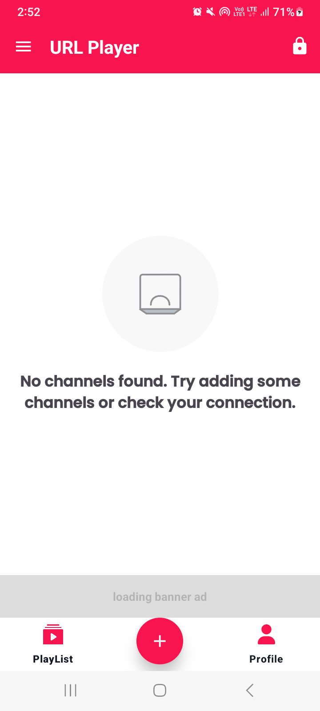
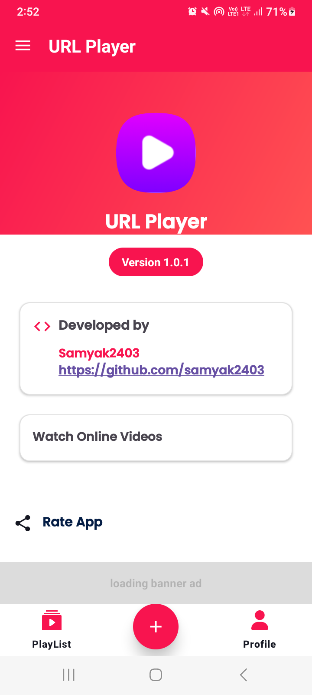
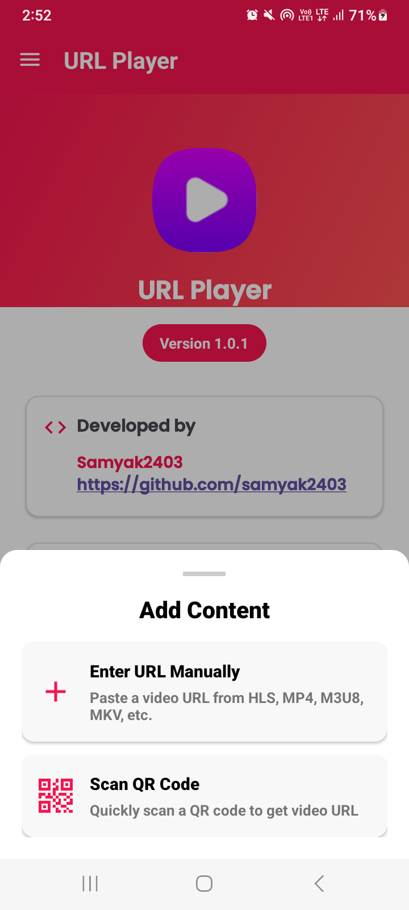
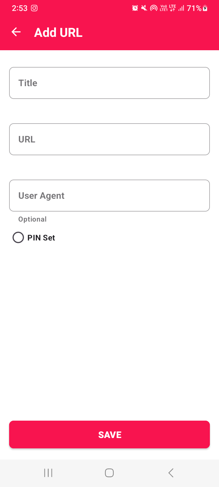
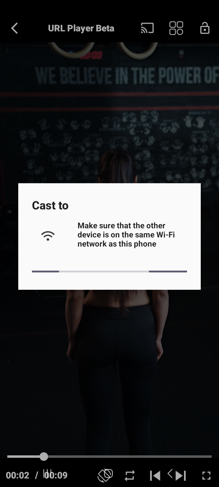

# URL Player - Android App

## Overview
URL Player is a versatile Android application that allows users to play videos from various URLs. It supports multiple video formats, streaming protocols, and provides a user-friendly interface for managing and playing media content.

## Features

### Media Playback
- Support for multiple video formats (MP4, MKV, AVI, WebM, etc.)
- Support for streaming protocols (HLS, DASH, RTMP, RTSP, etc.)
- Custom video player with playback controls
- Playlist support for M3U/M3U8 files

### URL Management
- Add URLs manually with custom titles
- Scan QR codes to add URLs
- PIN protection for sensitive content
- Edit and delete saved URLs

### User Interface
- Modern Material Design interface
- Bottom navigation for easy access to main features
- Navigation drawer for additional options
- Dark theme support

### Security
- PIN protection for individual channels
- PIN management system

### Additional Features
- Share app with friends
- Rate app on Play Store
- Provide feedback
- View privacy policy
- Language support

## Technical Details

### QR Scanner Implementation
The app includes a QR scanner feature that allows users to quickly add URLs by scanning QR codes. The QR scanner:
- Uses CameraX API for camera preview
- Implements ML Kit for barcode scanning
- Supports flashlight toggle for low-light environments
- Parses QR content to extract channel information

### URL Validation
The app validates URLs to ensure they are compatible with the player:
- Checks for supported video extensions
- Validates streaming protocols
- Detects content type (HLS, DASH, MP4, etc.)

### PIN Protection
For sensitive content, the app provides PIN protection:
- 4-digit PIN code for individual channels
- PIN verification before playback
- PIN management system

## Requirements
- Android 7.0 (API level 24) or higher
- Camera permission for QR scanning

## Libraries Used
- ExoPlayer/Media3 for video playback
- CameraX for camera preview
- ML Kit for barcode scanning
- Material Components for UI
- OkHttp for network requests
- Glide for image loading
- Firebase for analytics

## 📸 Screenshots 

<table align="center" style="width:100%; text-align:center; border-collapse:collapse;">  
  <tr>  
    <td></td>  
    <td></td>  
    <td></td>  
  </tr>  
  <tr>  
    <td></td>  
    <td></td>  
    <td></td>  
  </tr>  
  <tr>  
    <td></td>  
    <td></td>  
    <td></td>  
  </tr> 
</table>

## Future Enhancements
- Chromecast support
- Download manager for offline playback
- User accounts for cloud sync
- Advanced playlist management
- Picture-in-picture mode

## License
[Your License Information]

## Contact
For support or feedback, please contact: [Your Contact Information] 
